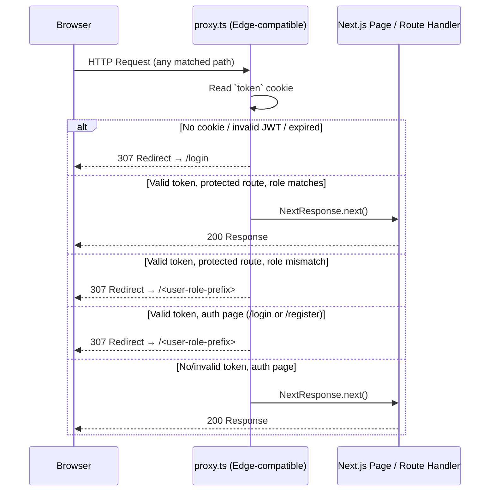
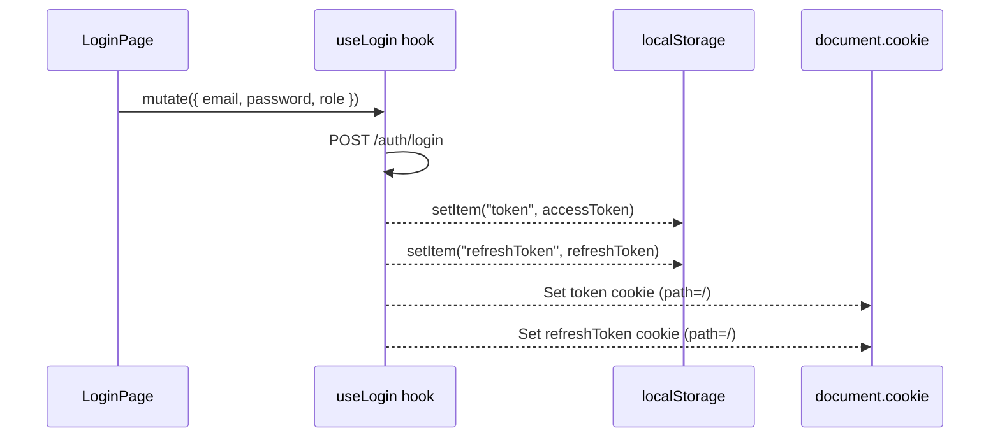

# Design Document: auth-middleware

## Overview

This feature adds authentication and role-based access control (RBAC) to the Dentline Clinic Next.js application via a `proxy.ts` file at the project root. The proxy intercepts every request to protected and auth routes, decodes a JWT stored in an HTTP-only cookie, and either allows the request through or issues a redirect.

> **Next.js 16 note:** In Next.js 16, `middleware.ts` is deprecated and renamed to `proxy.ts`. The exported function is renamed from `middleware` to `proxy`. The proxy defaults to the **Node.js runtime** in v16, but this implementation is written to be Edge-compatible (no Node.js-only APIs) to remain portable and fast.

Two complementary changes are required:

1. **`proxy.ts`** — the new proxy file that enforces auth and RBAC on every matched request.
2. **`hooks/useLogin.ts`** — updated to also write tokens to cookies (in addition to `localStorage`) so the proxy can read them.

### Goals

- Unauthenticated users are redirected to `/login` when they try to access any protected route.
- Authenticated users are redirected away from `/login` and `/register` to their role's home route.
- Users can only access the route group that matches their JWT role (`ADMIN → /admin`, `DOCTOR → /doctor`, `PATIENT → /patient`).
- JWT decoding uses only Web-standard APIs (`atob`, `TextDecoder`) — no `Buffer`, no `crypto` module.
- The existing `lib/axios.ts` interceptor continues to work unchanged (tokens remain in `localStorage`).

---

## Architecture

The proxy sits in front of all page and route-handler rendering. It runs before any React Server Component or Route Handler executes.



### Login cookie-writing flow



---

## Components and Interfaces

### 1. `proxy.ts` (project root)

The main proxy file. Exports a named `proxy` function and a `config` object with the matcher.

```typescript
// Exported function signature
export function proxy(request: NextRequest): NextResponse | Response

// Exported config
export const config = {
  matcher: [
    '/admin/:path*',
    '/doctor/:path*',
    '/patient/:path*',
    '/login',
    '/register',
  ],
}
```

**Internal helpers (co-located or in `lib/jwt.ts`):**

```typescript
// Decodes a JWT payload using only Web-standard APIs (atob)
// Returns the parsed payload object, or null on any error
function decodeJwtPayload(token: string): JwtPayload | null

// Checks whether a decoded payload is expired
function isExpired(payload: JwtPayload): boolean
```

### 2. `lib/jwt.ts` (new file)

Isolates the Edge-safe JWT decoding logic so it can be unit-tested independently of the proxy.

```typescript
export interface JwtPayload {
  role?: string
  exp?: number
  [key: string]: unknown
}

// Splits the JWT, Base64URL-decodes the payload segment, parses JSON
// Returns null on any error (malformed token, invalid base64, invalid JSON)
export function decodeJwtPayload(token: string): JwtPayload | null

// Returns true if payload.exp exists and is in the past (seconds since epoch)
export function isTokenExpired(payload: JwtPayload): boolean
```

### 3. `hooks/useLogin.ts` (modified)

The `onSuccess` callback is extended to write cookies in addition to `localStorage`.

```typescript
// Cookie names
const TOKEN_COOKIE = 'token'
const REFRESH_TOKEN_COOKIE = 'refreshToken'

// Cookie writing helper (client-side only, document.cookie)
function setAuthCookies(accessToken: string, refreshToken: string): void

// Cookie clearing helper (called on logout)
function clearAuthCookies(): void
```

### 4. Role–Route mapping

A shared constant (defined in `lib/jwt.ts` or inline in `proxy.ts`):

```typescript
export const ROLE_ROUTE_MAP: Record<string, string> = {
  ADMIN: '/admin',
  DOCTOR: '/doctor',
  PATIENT: '/patient',
}
```

---

## Data Models

### `JwtPayload`

The decoded JWT payload object. Only `role` and `exp` are required for routing decisions; other claims are preserved but ignored.

```typescript
interface JwtPayload {
  role?: string        // "ADMIN" | "DOCTOR" | "PATIENT" (or unknown value)
  exp?: number         // Unix timestamp (seconds). Absent means no expiry check.
  iat?: number         // Issued-at (informational)
  sub?: string         // Subject (user ID, informational)
  [key: string]: unknown
}
```

### Cookie schema

| Cookie name    | Value          | Attributes          | Written by       |
|----------------|----------------|---------------------|------------------|
| `token`        | JWT string     | `path=/`            | `useLogin` hook  |
| `refreshToken` | JWT string     | `path=/`            | `useLogin` hook  |

> **Security note:** The requirements specify `path=/` cookies written from client-side JavaScript (`document.cookie`). This means they are **not** `HttpOnly`. A future hardening step would move cookie-writing to a server-side API route so `HttpOnly; Secure; SameSite=Strict` attributes can be applied. This is out of scope for the current feature but should be tracked as a follow-up.

### Proxy decision matrix

| Route type     | Token state              | Action                                      |
|----------------|--------------------------|---------------------------------------------|
| Protected       | Missing                  | 307 → `/login`                              |
| Protected       | Invalid / malformed      | 307 → `/login`                              |
| Protected       | Expired                  | 307 → `/login`                              |
| Protected       | Valid, role matches      | `NextResponse.next()`                       |
| Protected       | Valid, role mismatch     | 307 → `ROLE_ROUTE_MAP[role]`                |
| Protected       | Valid, unknown role      | 307 → `/login`                              |
| Auth page       | Valid, non-expired       | 307 → `ROLE_ROUTE_MAP[role]`                |
| Auth page       | Missing / invalid        | `NextResponse.next()`                       |

---

## Correctness Properties

*A property is a characteristic or behavior that should hold true across all valid executions of a system — essentially, a formal statement about what the system should do. Properties serve as the bridge between human-readable specifications and machine-verifiable correctness guarantees.*

### Property 1: Cookie persistence on login

*For any* successful login response containing an `accessToken` and `refreshToken`, the `useLogin` hook's `onSuccess` handler SHALL write a cookie named `token` with the access token value and a cookie named `refreshToken` with the refresh token value, both with `path=/`, in addition to writing both values to `localStorage`.

**Validates: Requirements 1.1, 1.2, 1.3**

---

### Property 2: Unauthenticated requests to protected routes are redirected to /login

*For any* URL path that begins with `/admin`, `/doctor`, or `/patient`, a request that carries no `token` cookie SHALL result in a 307 redirect to `/login`.

**Validates: Requirements 3.1**

---

### Property 3: Invalid token on protected route redirects to /login

*For any* URL path under a protected route group, and *for any* string value in the `token` cookie that is not a structurally valid JWT (i.e., does not have exactly three dot-separated Base64URL segments), the proxy SHALL issue a 307 redirect to `/login`.

**Validates: Requirements 3.2, 6.2**

---

### Property 4: Expired token on protected route redirects to /login

*For any* protected route path, and *for any* JWT whose `exp` claim is a Unix timestamp strictly less than the current time, the proxy SHALL issue a 307 redirect to `/login`.

**Validates: Requirements 3.3**

---

### Property 5: Valid token on auth page redirects to role's home route

*For any* auth page path (`/login` or `/register`), and *for any* valid, non-expired JWT whose `role` claim is one of `ADMIN`, `DOCTOR`, or `PATIENT`, the proxy SHALL issue a 307 redirect to the corresponding prefix in `ROLE_ROUTE_MAP`.

**Validates: Requirements 4.1**

---

### Property 6: Role-matched access to protected routes is allowed through

*For any* path under `/admin` paired with an `ADMIN` token, *or* any path under `/doctor` paired with a `DOCTOR` token, *or* any path under `/patient` paired with a `PATIENT` token — the proxy SHALL return `NextResponse.next()` without modifying headers.

**Validates: Requirements 5.1, 7.1**

---

### Property 7: Role-mismatched access redirects to the user's own route

*For any* protected route path and *for any* valid, non-expired JWT whose `role` is a known role that does NOT match the route's required role, the proxy SHALL issue a 307 redirect to `ROLE_ROUTE_MAP[role]` (the user's own route prefix).

**Validates: Requirements 5.2**

---

### Property 8: Unknown role on protected route redirects to /login

*For any* protected route path and *for any* JWT whose `role` claim is a string not present in `ROLE_ROUTE_MAP`, the proxy SHALL issue a 307 redirect to `/login`.

**Validates: Requirements 5.3**

---

### Property 9: JWT decoding round-trip

*For any* object with a `role` string and an `exp` number, encoding it as a Base64URL JSON payload and passing it through `decodeJwtPayload` SHALL return an object with equal `role` and `exp` values.

**Validates: Requirements 6.1, 6.3**

---

### Property 10: All proxy redirects use status 307

*For any* request that triggers a redirect (unauthenticated protected route, expired token, role mismatch, auth page with valid token, unknown role), the response status code SHALL be 307.

**Validates: Requirements 7.2**

---

**Property Reflection — redundancy check:**

- Properties 2, 3, 4 all redirect to `/login` but test distinct token states (missing, malformed, expired). They are not redundant — each covers a different code path in `decodeJwtPayload` / expiry check.
- Property 6 and Property 7 are complementary: 6 tests the "allow" branch, 7 tests the "redirect" branch of the role-match check. Not redundant.
- Property 10 overlaps with 2–5 and 7–8 in that those properties also imply 307. However, Property 10 is kept as an explicit invariant to catch cases where a future change accidentally changes the status code. It is a metamorphic property over all redirect-producing inputs.
- Properties 1 and 9 are independent (client-side hook vs. pure JWT decoder). No redundancy.

---

## Error Handling

### JWT decoding errors

`decodeJwtPayload` wraps all operations in a `try/catch`. Any of the following conditions returns `null`:

- Token string is `undefined`, empty, or not a string.
- Token does not contain exactly two `.` characters (not three segments).
- The payload segment is not valid Base64URL (e.g., `atob` throws).
- The decoded string is not valid JSON (`JSON.parse` throws).
- The parsed value is not a plain object.

The proxy treats a `null` return from `decodeJwtPayload` as an invalid token and redirects to `/login`.

### Expiry check

If `payload.exp` is absent or not a number, the token is treated as **non-expiring** (allowed through). This is a deliberate lenient default — tokens without `exp` are considered valid indefinitely. If the backend always sets `exp`, this case will not arise in practice.

### Unknown role

If `payload.role` is absent, not a string, or not a key in `ROLE_ROUTE_MAP`, the proxy redirects to `/login`. This prevents a token with a corrupted or future role value from accessing any protected area.

### Cookie writing errors (useLogin)

`document.cookie` assignment does not throw. If the browser blocks cookie writes (e.g., private browsing with strict settings), the proxy will not find the cookie and will redirect to `/login` on the next navigation. The `localStorage` path in `lib/axios.ts` continues to work for API calls within the same session.

---

## Testing Strategy

### Unit tests (example-based)

Located in `__tests__/lib/jwt.test.ts` and `__tests__/proxy.test.ts`.

**`lib/jwt.ts` unit tests:**
- `decodeJwtPayload` returns `null` for empty string, non-string, one-segment, two-segment tokens.
- `decodeJwtPayload` returns the correct payload for a well-formed JWT.
- `decodeJwtPayload` returns `null` when the payload segment is not valid Base64URL.
- `decodeJwtPayload` returns `null` when the decoded payload is not valid JSON.
- `isTokenExpired` returns `true` for a past `exp`, `false` for a future `exp`, `false` when `exp` is absent.

**`proxy.ts` matcher tests (using `unstable_doesProxyMatch`):**
- `/admin/dashboard`, `/doctor/appointments`, `/patient/profile` → matched.
- `/login`, `/register` → matched.
- `/_next/static/chunk.js`, `/_next/image`, `/favicon.ico`, `/api/auth/login` → not matched.
- `/`, `/about`, `/contact` → not matched.

**`hooks/useLogin.ts` unit tests:**
- `onSuccess` sets `document.cookie` for `token` and `refreshToken` with `path=/`.
- `onSuccess` calls `localStorage.setItem` for both keys.
- Logout helper deletes both cookies and clears `localStorage`.

### Property-based tests

Located in `__tests__/proxy.property.test.ts` and `__tests__/lib/jwt.property.test.ts`.

Uses **[fast-check](https://github.com/dubzzz/fast-check)** (already compatible with the project's TypeScript/Jest setup; add as a dev dependency).

Each property test runs a minimum of **100 iterations**.

Tag format: `// Feature: auth-middleware, Property <N>: <property_text>`

| Test | Property | Generator |
|------|----------|-----------|
| Cookie persistence | Property 1 | `fc.string()` for token values |
| No-cookie → /login | Property 2 | `fc.constantFrom('/admin', '/doctor', '/patient')` + `fc.string()` for sub-paths |
| Invalid token → /login | Property 3 | `fc.string()` filtered to exclude valid JWT shape |
| Expired token → /login | Property 4 | JWT with `exp = Date.now()/1000 - fc.integer({min:1})` |
| Auth page + valid token → role redirect | Property 5 | `fc.constantFrom('ADMIN','DOCTOR','PATIENT')` for role, `fc.constantFrom('/login','/register')` for path |
| Role-matched → next() | Property 6 | Generate (route_group, matching_role) pairs |
| Role-mismatch → own route | Property 7 | Generate (route_group, mismatched_role) pairs |
| Unknown role → /login | Property 8 | `fc.string()` filtered to exclude known roles |
| JWT decode round-trip | Property 9 | `fc.record({ role: fc.string(), exp: fc.integer() })` |
| All redirects are 307 | Property 10 | Union of all redirect-triggering generators |

### Integration tests

Not required for this feature — the proxy logic is pure (no external I/O). The `lib/axios.ts` refresh flow is tested separately.

### Test framework

The project has no test framework configured yet. Add **Jest** + **ts-jest** + **fast-check**:

```bash
npm install --save-dev jest ts-jest @types/jest fast-check
```

Add to `package.json`:
```json
"jest": {
  "preset": "ts-jest",
  "testEnvironment": "node"
}
```
